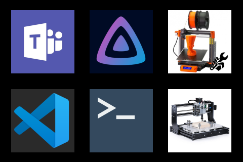

# PyPortal App Launcher

StreamDeck Mini like 6 button macro keypad running on a PyPortal Titano

I liked my streamdeck ok, but found the need to run software on the connected PC to run it to be a pain when switching back and forth between linux and windows. I did write a node program I liked but eventually sold it when the pandemic hit and they were selling for more than retail.  I also found that I don't really need that many shortcut keys or much interactivity so I think this Python solution should work well for me.

### Source Project By John Furcean

Github - [https://github.com/jfurcean/pyportal-app-launcher](https://github.com/jfurcean/pyportal-app-launcher)

Instructions - [https://furcean.com/2019/03/21/pyportal-app-launcher](https://furcean.com/2019/03/21/pyportal-app-launcher)
